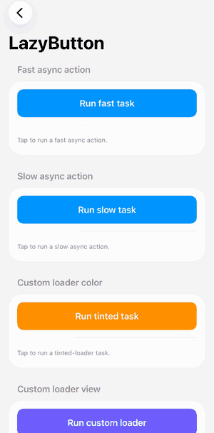
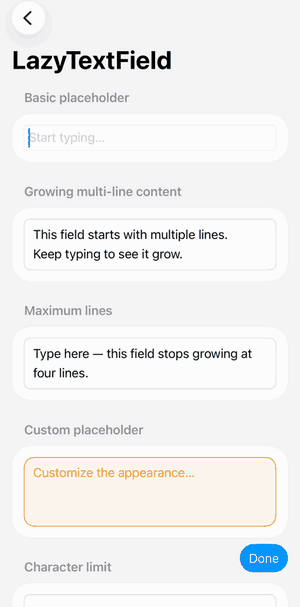

# LazyKit


LazyKit is a small SwiftUI component library for the last twenty percent.

SwiftUI gets you most of the way, then leaves the rest to you: a button that
cannot await its own work, a text field with no placeholder, a character limit
that has to survive a paste. You have written all of it before, probably twice,
slightly differently each time.

The name is about the developer, not the code: be lazy on purpose about the
parts that were never interesting. 🛋️

 

## What it solves

| Component | What it is | The gap in SwiftUI | What LazyKit does instead |
| --- | --- | --- | --- |
| [`LazyButton`](docs/components/LazyButton.md) | An async button that handles its own loading state. | `Button`'s action is synchronous, so `try await` inside it does not compile. Async buttons get hand-rolled — a `Task`, an `isBusy` flag, a spinner — and most of them flicker. | An `async`, main-actor action tied to the view's lifecycle, repeat taps ignored while it runs, and a loader that waits before appearing and holds once shown. |
| [`LazyTextField`](docs/components/LazyTextField.md) | A self-sizing multi-line field with a placeholder. | `TextEditor` has no placeholder and no intrinsic height. `TextField(axis: .vertical)` grows, but the placeholder, the line range, and a paste-proof character cap are all still on you. | Growth and the native prompt for free, one `lineLimit` range that scrolls internally past the cap, and a character limit clamped in the same update as the edit. |

## Quick start

```swift
import LazyKit
import SwiftUI

struct NoteView: View {
    @State private var note = ""

    var body: some View {
        VStack(spacing: 16) {
            LazyButton("Save") {
                try? await api.save(note) // async work
            }

            LazyTextField(text: $note, placeholder: "Write a note…")
        }
        .padding()
    }
}
```

## Requirements

- iOS 17+ or macOS 14+
- Swift 6 toolchain (the package uses `swift-tools-version: 6.0`)

## Installation

LazyKit follows [semantic versioning](https://semver.org), so pin a release:

```swift
dependencies: [
    .package(url: "https://github.com/rafattouqir/LazyKit.git", from: "0.1.0")
]
```

Or in Xcode, choose **File ▸ Add Package Dependencies…** and enter
`https://github.com/rafattouqir/LazyKit.git`.

`from:` accepts any release in that minor version. Pin an exact tag with
`.exact(_:)`, or track unreleased changes with `.branch("main")`.

## Demo app

`Demo/LazyKitDemo.xcodeproj` exercises every component and every configuration
documented in `docs/components/`. Open it, pick the `LazyKitDemo` scheme, and
run it on any iOS Simulator.

## Development

```bash
# Formatting (also enforced in CI)
swift format lint --strict --parallel --recursive Sources Tests Demo

# Unit tests
swift test

# Demo app and UI tests
xcodebuild -project Demo/LazyKitDemo.xcodeproj \
  -scheme LazyKitDemo \
  -destination 'platform=iOS Simulator,name=iPhone 17' \
  test
```

CI runs the formatter lint and the test suites on every push and pull request;
the demo target's lint build phase reports formatter issues as Xcode warnings.

To cut a release, see [Releasing](docs/releasing.md).

## License

LazyKit is available under the MIT license. See [LICENSE](LICENSE) for details.
